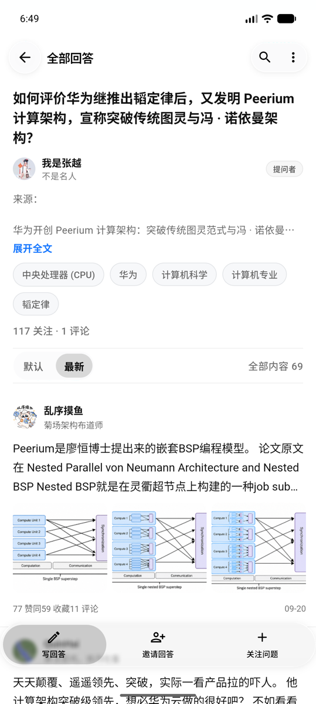
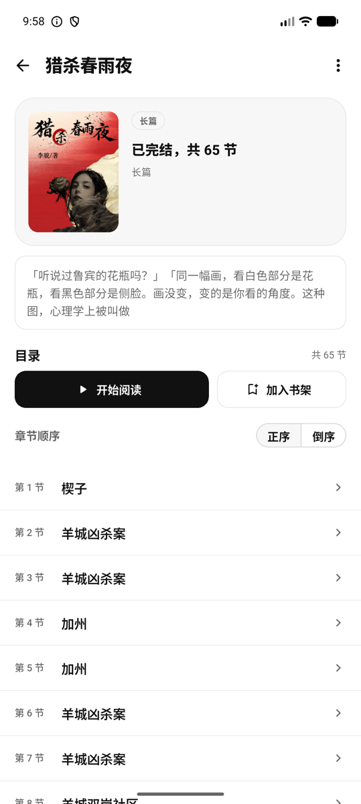
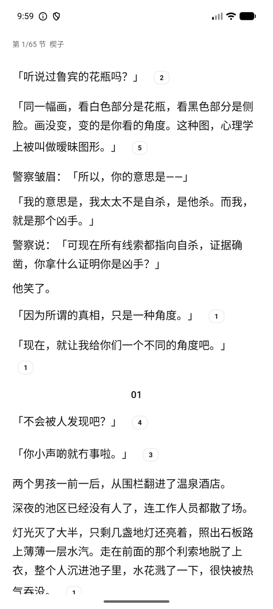
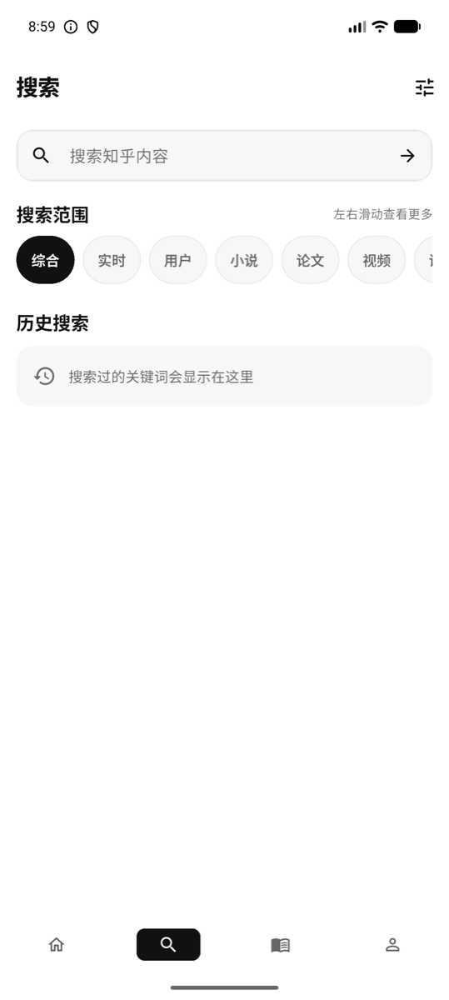
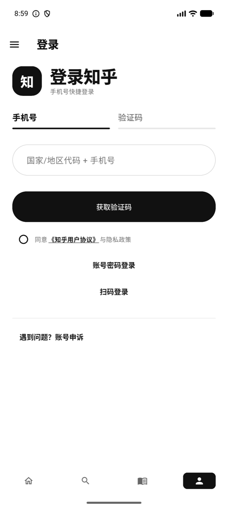

# 知阅

感谢 [zly2006/zhihu-plus-plus](https://github.com/zly2006/zhihu-plus-plus) 项目。本项目参考了其中公开的接口实现，并据此完成了多项功能补全、交互优化和客户端行为对齐。

知阅是一款使用 Flutter 开发的第三方知乎客户端，侧重原生化阅读体验、完整内容展示、盐选故事阅读、评论交互、隐私保护和本地数据管理。

> 当前版本：0.2.10<br>
> 支持平台：Android arm64、macOS、Windows x64<br>
> Android / iOS 应用标识：`com.zhiyue.client`<br>
> 接口库：[LunaLuna111/zhihu_api](https://github.com/LunaLuna111/zhihu_api)

## 界面预览

以下截图来自 Android 手机模拟器，未包含登录凭据、手机号或账号资料。

<p align="center">
  
  
  
</p>

<p align="center">
  
  
  
  
</p>

## 主要功能

### 内容浏览

- 关注、推荐、热榜和故事频道
- 问题、回答、文章、视频及用户主页
- 搜索分类、筛选、历史记录、关键词补全和结果卡片
- 浏览历史、稍后读、点赞及收藏状态
- 图片预览、缩放和保存到系统相册
- 阅读页顶部栏与底部栏自动隐藏

### 评论与互动

- 评论列表、楼中楼回复和回复目标切换
- 文字、知乎表情、图片及混合内容展示
- 选中文本后评论对应内容片段
- 点赞、反对、关注和内容操作
- 输入法与表情面板状态切换
- 未登录时允许编辑，提交操作前提示登录

### 盐选与书架

- 盐选故事首页、分类和榜单
- 长篇作品详情、作者资料、标签和章节目录
- 正序与倒序章节浏览
- 阅读进度、书架管理和多选操作
- 章节缓存、离线阅读及下载数量展示
- TTS 朗读和章节切换

### 登录与账号

- 手机号验证码登录
- 账号密码登录
- QR 扫码登录
- 本地多账号保存与切换
- 会话失效保护和认证恢复
- 安全存储登录凭据

### 链接与导出

- 知乎站内链接优先使用原生页面
- 外部链接先进入安全提示页
- 确认后使用受限 WebView 访问外部网页
- Markdown、HTML、DOCX 和 PDF 内容导出
- 图片保存与本地诊断日志导出

## 技术结构

```text
lib/
├── core/       会话、缓存、网络适配、更新、日志与基础模型
├── features/   书架、账号等独立业务模块
├── pages/      页面入口及按页面拆分的实现
├── ui/         主题、间距和通用视觉组件（ZhSurface、ZhPanel、ZhIconTile、ZhPill、公共按钮）
└── widgets/    内容卡片、评论、输入框和阅读组件

assets/
├── api_contract.json
└── emoji/      普通及 VIP 表情资源

test/           模型、接口适配、交互和布局测试
docs/           README 使用的项目界面截图
```

知乎 API 的路由、模型、解析、会话协议和请求能力由独立纯 Dart 包
[zhihu_api](https://github.com/LunaLuna111/zhihu_api) 提供。客户端保留 Flutter UI、Android 平台通道、安全存储、系统文件导出和安装器适配。

## UI 公共层

公共视觉组件由 `lib/ui/zh_components.dart` 统一导出，实际实现按布局、表面容器和操作控件拆分在 `lib/ui/components/`，页面只组合业务内容和交互状态：

- `ZhSurface`：需要桌面悬停反馈的内容卡片。
- `ZhPanel`：Material 原生边框面板，适合设置项、列表行和紧凑卡片。
- `ZhIconTile`：统一图标底板的尺寸、圆角、颜色和边框。
- `ZhPrimaryButton`、`ZhOutlineButton`、`ZhGhostButton`：统一按钮高度、图标间距和主题状态。
- `ZhPill`、`ZhSectionHeader`、`ZhPagingIndicator`：统一标签、分区标题和分页加载反馈。

新增页面优先复用这些组件；只有业务确实需要不同交互或特殊布局时，才在页面内定义专用组件。

## 平台支持

| 平台 | 构建产物 | 当前状态 |
| --- | --- | --- |
| Android arm64 | APK | 支持运行、安装及应用内更新 |
| macOS | APP ZIP | 支持桌面窗口与自适应导航 |
| Windows x64 | ZIP | 支持桌面窗口与自适应导航 |

Android 是主要移动端目标。macOS 和 Windows 共用 Flutter 桌面布局，支持内容浏览、搜索、阅读、账号与本地数据功能。依赖 Android 平台通道的安装包更新和部分原生能力会按平台自动降级。

## 下载

前往 [GitHub Releases](https://github.com/LunaLuna111/zhiyue/releases) 下载当前版本：

- Android：`arm64.apk`
- macOS：`macos.zip`，同时支持 Apple Silicon 和 Intel
- Windows：`windows-x64.zip`

macOS 构建目前未经过 Apple 公证。Windows 和 macOS 压缩包解压后运行，Android 使用系统安装器安装 APK。

## 环境要求

- Flutter stable
- Dart 3.12 或更高版本
- Java 17
- Android 构建需要 Android SDK 和 Java 17
- macOS 构建需要完整 Xcode
- Windows 构建需要 Visual Studio 的 Desktop development with C++ 工作负载

查看环境：

```bash
flutter doctor
```

## 获取源码与依赖

```bash
git clone https://github.com/LunaLuna111/zhiyue.git
cd zhiyue
flutter pub get
```

`zhihu_api` 通过 GitHub tag 获取，不依赖本机相对路径：

```yaml
zhihu_api:
  git:
    url: https://github.com/LunaLuna111/zhihu_api.git
    ref: v0.2.1
```

阅读正文与书架使用独立的通用 `universal_reader` Flutter/Dart 库。客户端把书籍信息、目录、章节和正文格式，以及书架条目、加载状态和操作回调传入库；知乎接口、盐选传输解密、缓存和 Flutter 平台能力保留在客户端适配层。

```yaml
universal_reader:
  git:
    url: https://github.com/LunaLuna111/universal_reader.git
    ref: v0.3.0
```

## 运行

列出可用设备：

```bash
flutter devices
```

运行到指定 Android 设备：

```bash
flutter run -d <device-id>
```

应用启动后，推荐、热榜、故事和公开内容不要求登录；发布评论、点赞、关注等写操作需要有效账号会话。

## 代码检查与测试

```bash
flutter analyze --no-pub
flutter test --no-pub
```

单独执行 GitHub Release 更新测试：

```bash
flutter test --no-pub test/app_update_service_test.dart
```

## 构建 Android APK

```bash
flutter build apk \
  --release \
  --target-platform android-arm64 \
  --obfuscate \
  --split-debug-info=build/symbols/arm64-release \
  --tree-shake-icons
```

默认产物：

```text
build/app/outputs/flutter-apk/app-release.apk
```

`build/symbols/` 包含崩溃符号化所需文件，不应随 APK 公开发布。

## 构建桌面客户端

macOS 构建命令：

    flutter config --enable-macos-desktop
    flutter build macos --release

Windows 构建命令：

    flutter config --enable-windows-desktop
    flutter build windows --release

Windows 必须在 Windows 主机上构建，macOS 必须在安装完整 Xcode 的 macOS 主机上构建，Flutter 不支持这两个目标之间直接交叉编译。

仓库中的 .github/workflows/build-clients.yml 可以手动运行，也会在推送 v* 标签时运行。它分别生成 Android arm64 APK、macOS APP ZIP 和 Windows x64 ZIP。工作流只上传最终分发包，不上传调试符号、构建缓存和 runner 环境文件。

## GitHub Releases 更新

客户端使用 GitHub REST API 读取指定仓库的最新稳定 Release，不依赖额外更新服务器。

Release 必须满足以下约定：

```text
Release 标签：v<versionName>
APK 文件名：zhiyue-<versionName>+<versionCode>-arm64.apk
```

例如：

```text
Release 标签：v0.2.10
APK 文件名：zhiyue-0.2.10+122-arm64.apk
```

下载和安装前会依次检查：

1. Release 不是草稿或预发布版本。
2. APK 来自配置的 GitHub 仓库。
3. 标签、文件名和版本信息保持一致。
4. 文件大小和 GitHub SHA-256 摘要一致。
5. APK 包名与当前应用一致。
6. APK versionCode 与 Release 声明一致。
7. APK 签名证书与当前安装版本一致。
8. 最终由 Android 系统安装器确认安装。

如需使用派生仓库发布更新，可在构建时覆盖仓库地址：

```bash
flutter build apk \
  --dart-define=ZHIYUE_GITHUB_REPOSITORY=owner/repository
```

## 数据与隐私

- 登录凭据保存在系统安全存储和应用私有目录。
- 不在源码、资源或构建配置中写入 Cookie、访问令牌、手机号和账号资料。
- 本地诊断日志默认关闭，不提供网络上传接口。
- 日志不记录 Cookie、Authorization、请求正文或响应正文。
- 搜索记录、浏览记录、书架和阅读缓存只保存在本机。
- 用户可以在应用内清理会话、历史、缓存和诊断日志。
- 外部网页访问前显示目标域名与完整地址。
- Release 构建不需要共享更新密钥或日志上传令牌。

提交代码前应再次检查：

```bash
git status --short
git diff --check
flutter analyze --no-pub
flutter test --no-pub
```

请勿提交以下内容：

- `.env`、私钥、证书和 keystore
- Android `local.properties` 或签名配置
- 登录会话、Cookie、访问令牌和网络抓取数据
- APK、AAB、符号文件和本机构建缓存
- 包含个人路径、账号或设备信息的日志与截图

## 已知限制

- Android、macOS 和 Windows 的平台插件能力并不完全相同。
- 部分写接口会受到账号权限、风控或平台接口变化影响。
- 盐选内容是否可读取取决于账号权限和作品状态。
- GitHub Release 尚未发布时，应用内更新页会显示没有可用稳定版本。

## 贡献

欢迎提交 Issue 和 Pull Request。提交前请确保：

1. 修改范围明确，没有加入账号数据或本机文件。
2. 新增接口能力优先放入独立 `zhihu_api` 包。
3. 客户端只保留 UI、状态管理和平台适配。
4. 静态分析及相关测试通过。
5. 涉及交互时附上不包含隐私信息的截图或复现步骤。

## 免责声明

本项目仅用于学习和技术交流，不得用于任何商业用途。项目完全免费、开源、非商用，不收取费用，也不接受任何形式的打赏。项目所涉及的接口资料来自互联网及 GitHub 上可公开获取的信息，经整理后用于学习研究。

本项目与知乎官方无关。“知乎”及相关名称、商标和内容归其权利人所有。使用者应遵守所在地法律法规、平台服务协议和内容版权要求，并自行承担使用本项目产生的风险与责任。
